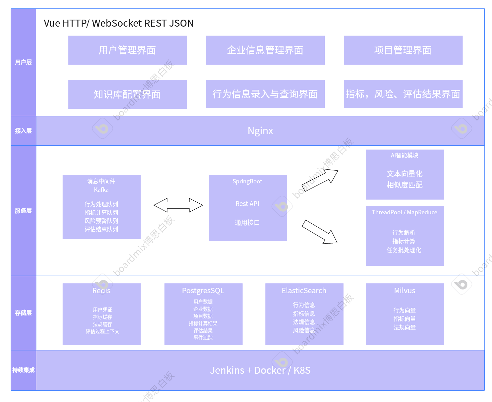
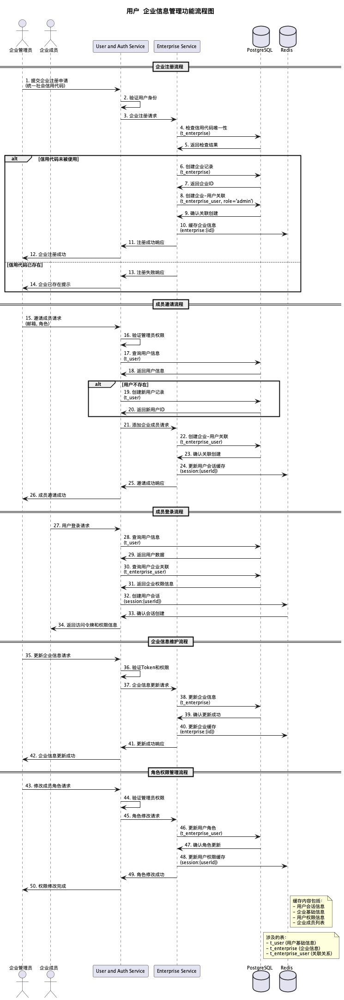
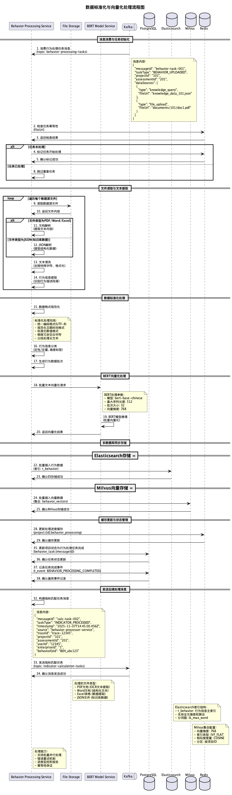
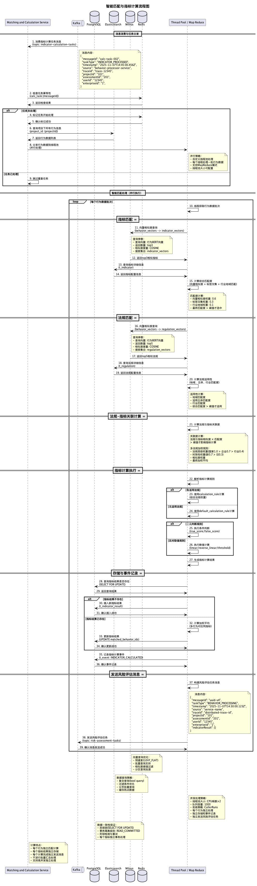
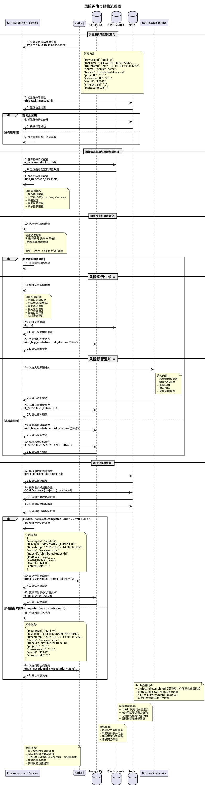
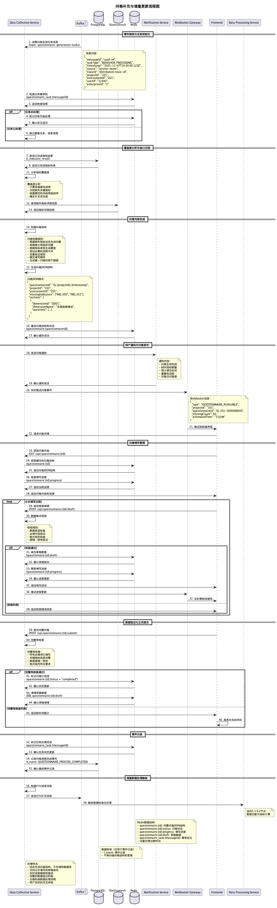
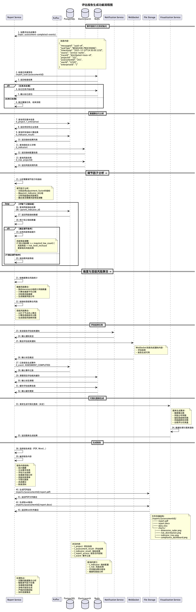

# 系统设计文档

## 1. 引言

### 1.1. 文档目的

本文档用于进行系统技术选型，架构设计，数据库规定，流程规定和api设计

## 2. 技术选型

### 2.1. 前端框架

Vue

### 2.2. 后端框架

Spring Cloud + Spring Boot + Nacos(未定)

Netty

建立WebSocket长连接，实现实时通知和消息推送功能

### 2.3. 数据库

#### 2.3.1. 关系型数据库

PostgreSQL（Supabase作为开发时使用）

##### 2.3.2. 非关系型数据库

Elasticsearch

#### 2.3.3. 向量数据库

Milvus

存储系统的指标、法规标准和行为信息的向量化数据

#### 2.3.4. 缓存数据库

Redis

存储系统缓存：用户凭证、指标、法规、评估中间过程

### 2.4. 文本向量化

BERT

向量化

### 2.5. 部署方案

Docker

## 3. 系统架构

### 3.1. 总体架构图



#### 3.1.1. 架构层次说明

**用户层**

- Web浏览器：提供桌面端访问入口

**接入层**

- 负载均衡器：分发用户请求，保障系统高可用
- API网关：统一API入口，提供认证、限流、监控功能

**前端层**

- Vue前端应用：基于Vue框架的单页应用
- 模块化界面：用户管理、项目管理、评估报告、数据可视化等功能模块

**后端服务层**

- Spring Boot应用：微服务架构的核心业务逻辑
- 11个核心服务模块：涵盖完整的业务功能链条

**消息中间件**

- Kafka：异步任务处理，解耦业务流程
- 四大队列：行为处理、计算任务、风险预警、报告生成

**AI算法层**

- BERT模型服务：提供AI能力支撑
- 核心算法：文本向量化、语义匹配、智能分析

**数据层**

- PostgreSQL：关系型数据存储，保障数据一致性
- Elasticsearch：搜索引擎，支持全文检索和复杂查询
- Milvus：向量数据库，支持AI语义搜索
- Redis：缓存数据库，提升系统性能

#### 3.1.2. 数据流向

1. **用户请求流向**：用户层 → 接入层 → 前端层 → 后端服务层
2. **数据处理流向**：后端服务层 → 消息中间件 → AI算法层 → 数据层
3. **外部数据流向**：外部接入层 → 后端服务层 → 数据层
4. **事件驱动流向**：消息中间件 ⇄ 后端服务层（双向异步通信）

### 3.2. 模块划分

#### 3.2.1. 用户与权限管理模块

- **用户认证与授权**
- **多级权限控制**：企业级权限（admin/member）、项目级权限（project_admin/editor/viewer）
- **用户生命周期管理**：注册、激活、密码重置、账户禁用
- **会话管理**：登录状态维护、单点登录、会话超时控制
- **操作审计**：记录用户关键操作日志，支持审计追踪

#### 3.2.2. 企业信息管理模块

- **企业档案管理**：企业基本信息录入、修改、查询
- **企业认证**：统一社会信用代码验证、企业资质审核
- **企业层级管理**：支持集团企业的子公司层级关系
- **企业用户管理**：企业成员邀请、角色分配、权限控制
- **企业配置管理**：行业分类、地域设置、合规标准配置

#### 3.2.3. 项目管理模块

- **项目生命周期管理**：项目创建、进行中、已完成、已归档状态管理
- **项目配置**：评估类型（常规/专项）、行业维度、地域范围设置
- **项目团队管理**：项目成员添加、角色分配、权限管理
- **项目进度跟踪**：计划与实际完成时间对比、里程碑管理

#### 3.2.4. 行为信息处理模块

- **文档解析与提取**：支持PDF、Word、Excel等格式的行为信息提取
- **行为信息标准化**：数据清洗、格式统一、缺失值处理
- **行为分类与标签**：自动分类（定性/定量）、维度标签、状态管理
- **向量化处理**：使用BERT模型对行为描述进行向量化
- **行为信息存储**：结构化存储到Elasticsearch，支持全文搜索

#### 3.2.5. 知识库管理模块

- **指标库管理**：指标定义、层级关系、计算规则配置
- **法规库管理**：法规文本录入、分类、向量化存储
- **知识库维护**：版本控制、更新推送、废弃标记
- **知识库搜索**：基于关键词和语义的智能搜索
- **知识库同步**：支持外部法规库API对接，自动更新

#### 3.2.6. 智能匹配与指标计算模块

- **语义相似度匹配**：基于BERT向量的行为-指标语义匹配
- **规则驱动匹配**：基于关键词、正则表达式的精确匹配
- **行业/地域过滤**：根据项目配置进行智能过滤
- **匹配结果排序**：相似度评分、置信度计算
- **匹配策略配置**：匹配阈值、权重调整、策略优化
- **多种计算规则支持**：二元判断规则、区间取值规则
- **动态计算引擎**：根据指标定义动态执行计算逻辑
- **批量计算处理**：支持项目级批量指标计算
- **计算结果存储**：详细的计算过程记录，支持结果追溯
- **计算性能优化**：缓存机制、并行计算、增量更新

#### 3.2.7. 风险评估模块

- **风险规则引擎**：基于指标分数的动态风险触发
- **调节因子机制**：考虑同级指标的综合风险评估
- **风险等级评定**：低、中、高、严重四级风险等级
- **风险实例生成**：动态生成风险记录，关联触发指标
- **风险趋势分析**：历史风险对比、趋势预测

#### 3.2.8. 评估报告模块

- **报告模板管理**：多种报告模板，支持自定义模板
- **数据聚合分析**：多维度数据统计、趋势分析
- **可视化图表生成**：柱状图、饼图、雷达图等多种图表
- **报告导出功能**：支持PDF、Word、Excel格式导出
- **报告分享与权限**：报告链接分享、查看权限控制

#### 3.2.9. 事件管理模块

- **系统事件记录**：行为摄取、指标计算、风险触发等核心事件
- **事件分类管理**：按事件类型分类存储和查询
- **事件统计分析**：事件频次统计、异常事件监控
- **事件审计日志**：完整的操作链路追踪，支持合规审计

#### 3.2.10. 数据可视化模块

- **实时仪表板**：项目进度、风险状态、指标分布实时展示
- **交互式图表**：支持钻取、筛选、联动的动态图表
- **多维度分析视图**：按行业、地域、时间等维度的数据透视

### 3.3. 服务架构设计

基于微服务架构模式，将系统功能模块合理拆分为独立的服务单元，每个服务专注于特定的业务领域，支持独立开发、部署和扩展。

#### 3.3.1. 核心业务服务

**1. User and Auth Service (用户认证服务)**

- **职责范围**: 用户管理、认证授权、会话管理
- **对应模块**: 3.2.1 用户与权限管理模块
- **主要功能**:
  - 用户注册、激活、密码管理
  - 用户信息维护与查询
  - 用户状态管理
  - 用户登录/登出、Token生成与验证
  - 多级权限控制（企业级、项目级）
  - 会话状态维护、单点登录
  - 操作审计日志记录

**2. Enterprise Service (企业服务)**

- **职责范围**: 企业信息管理、企业用户关系
- **对应模块**: 3.2.2 企业信息管理模块
- **主要功能**:
  - 企业档案管理、信用代码验证
  - 企业成员邀请与角色分配
  - 企业层级关系管理
  - 企业配置管理（行业、地域等）

**3. Project Service (项目服务)**

- **职责范围**: 项目生命周期管理、项目配置
- **对应模块**: 3.2.3 项目管理模块
- **主要功能**:
  - 项目创建与配置、状态流转
  - 项目团队管理、权限分配
  - 项目进度跟踪、里程碑管理
  - 评估结果初始化

**4. Data Collection Service（数据收集服务）**

- **职责范围**: 行为信息采集
- **对应模块**: 3.2.4 行为信息处理模块
- **主要功能**:
  - 文档上传接口（PDF、Word、Excel）
  - 知识库查询、录入
  - 问卷生成与提交

**5. Behavior Processing Service (行为处理服务)**

- **职责范围**: 行为信息处理、文档解析
- **对应模块**: 3.2.4 行为信息处理模块
- **主要功能**:
  - 行为信息标准化与分类
  - BERT模型调用、文本向量化
  - 问卷数据处理
  - 批量数据处理任务管理

**6. Knowledge Service (知识库服务)**

- **职责范围**: 知识库管理、指标和法规维护
- **对应模块**: 3.2.5 知识库管理模块
- **主要功能**:
  - 指标库管理（定义、层级、计算规则）
  - 法规库管理（录入、分类、维护）
  - 知识库搜索与查询
  - 版本控制与更新推送

#### 3.3.2. 核心计算服务

**7. Matching and Calculation Service (匹配计算服务)**

- **职责范围**: AI算法、语义匹配、指标计算
- **对应模块**: 3.2.6 智能匹配与指标计算模块、BERT向量化
- **主要功能**:
  - 语义相似度计算、行为-指标-法规智能匹配
  - 动态计算引擎、规则解析
  - 二元判断与区间取值计算
  - 层级计算与结果汇总
  - 计算结果缓存与存储

**8. Risk Assessment Service (风险评估服务)**

- **职责范围**: 风险规则引擎、风险实例管理
- **对应模块**: 3.2.7 风险评估模块
- **主要功能**:
  - 风险规则判定与触发
  - 调节因子机制应用
  - 风险实例生成与等级评定
  - 风险传播与聚合

**9. Report Service (报告服务)**

- **职责范围**: 报告生成、数据聚合（指标、风险的层级传播、聚合）
- **对应模块**: 3.2.8 评估报告模块
- **主要功能**:
  - 评估数据聚合与统计分析
  - 多格式报告导出（PDF、Word、Excel）

**10. Event Service (事件服务)**

- **职责范围**: 事件管理、系统审计
- **对应模块**: 3.2.9 事件管理模块
- **主要功能**:
  - 系统事件记录与分类
  - 事件统计分析与监控
  - 审计日志管理
  - 事件通知与告警

**11. Visualization Service (可视化服务)**

- **职责范围**: 数据可视化、仪表板
- **对应模块**: 3.2.10 数据可视化模块
- **主要功能**:
  - 实时仪表板数据聚合
  - 交互式图表生成
  - 多维度数据分析
  - 自定义图表配置

**12. Notification Service (通知服务)**

- **职责范围**: 消息通知、预警推送、依靠Netty实现WebSocket长连接
- **跨模块功能**: 支撑所有需要通知的业务场景
- **主要功能**:
  - 多渠道通知（邮件、短信、WebSocket）
  - 风险预警消息推送
  - 评估完成通知
  - 系统异常告警

#### 3.3.4. 服务间通信模式

**同步通信**

- **REST API**: 服务间的主要通信方式
- **gRPC**: 高性能场景下的服务调用
- **使用场景**: 实时查询、状态检查、配置获取

**异步通信**

- **Kafka消息队列**: 事件驱动的异步处理
- **使用场景**: 行为处理、指标计算、风险评估、通知推送

**数据一致性**

- **最终一致性**: 通过事件驱动保证业务数据最终一致
- **补偿机制**: 失败场景的数据补偿和重试策略

#### 3.3.6. 服务部署策略

**容器化部署**

- 所有服务基于Docker容器化部署
- 支持Kubernetes集群编排
- 实现服务的水平扩展和负载均衡

**独立数据库**

- 每个服务拥有独立的数据存储
- 避免数据库层面的紧耦合
- 支持不同服务选择最适合的存储技术

**监控与运维**

- 统一的日志收集（ELK栈）
- 分布式链路追踪（SkyWalking/Zipkin）
- 服务健康检查与自动重启

## 4. 数据库设计

### 4.1. 概念模型 (E-R图)


### 4.2. 物理模型

#### 4.2.1. PostgreSQL 表结构

**1. 用户表 (t_user)**


| 字段名     | 数据类型    | 约束            | 默认值 | 描述               |
| :--------- | :---------- | :-------------- | :----- | :----------------- |
| id         | BIGSERIAL   | PRIMARY KEY     | 自增   | 用户唯一标识       |
| email      | TEXT        | UNIQUE NOT NULL | -      | 用户邮箱，唯一标识 |
| full_name  | TEXT        | -               | -      | 用户全名           |
| avatar_url | TEXT        | -               | -      | 用户头像URL        |
| created_at | TIMESTAMPTZ | NOT NULL        | NOW()  | 创建时间           |
| updated_at | TIMESTAMPTZ | NOT NULL        | NOW()  | 更新时间           |

**2. 企业表 (t_enterprise)**


| 字段名               | 数据类型    | 约束            | 默认值 | 描述                   |
| :------------------- | :---------- | :-------------- | :----- | :--------------------- |
| id                   | BIGSERIAL   | PRIMARY KEY     | 自增   | 企业唯一标识           |
| name                 | TEXT        | NOT NULL        | -      | 企业名称               |
| credit_code          | TEXT        | UNIQUE NOT NULL | -      | 统一社会信用代码，唯一 |
| type                 | TEXT        | -               | -      | 企业类型               |
| industry             | TEXT        | -               | -      | 行业分类               |
| business_scope       | TEXT        | -               | -      | 经营范围               |
| registered_capital   | NUMERIC     | -               | -      | 注册资本               |
| establishment_date   | DATE        | -               | -      | 成立日期               |
| legal_representative | TEXT        | -               | -      | 法定代表人             |
| registered_address   | TEXT        | -               | -      | 注册地址               |
| business_status      | TEXT        | -               | -      | 经营状态               |
| created_at           | TIMESTAMPTZ | NOT NULL        | NOW()  | 创建时间               |
| updated_at           | TIMESTAMPTZ | NOT NULL        | NOW()  | 更新时间               |

**3. 企业用户关联表 (t_enterprise_user)**


| 字段名        | 数据类型        | 约束                                 | 默认值   | 描述               |
| :------------ | :-------------- | :----------------------------------- | :------- | :----------------- |
| enterprise_id | BIGINT          | REFERENCES t_enterprise(id)          | -        | 企业ID             |
| user_id       | BIGINT          | REFERENCES t_user(id)                | -        | 用户ID             |
| role          | enterprise_role | NOT NULL                             | 'member' | 用户在企业中的角色 |
| -             | -               | PRIMARY KEY (enterprise_id, user_id) | -        | 复合主键           |

**4. 项目表 (t_project)**


| 字段名                  | 数据类型                   | 约束                        | 默认值   | 描述               |
| :---------------------- | :------------------------- | :-------------------------- | :------- | :----------------- |
| id                      | BIGSERIAL                  | PRIMARY KEY                 | 自增     | 项目唯一标识       |
| enterprise_id           | BIGINT                     | REFERENCES t_enterprise(id) | -        | 关联的企业ID       |
| name                    | TEXT                       | NOT NULL                    | -        | 项目名称           |
| type                    | project_type               | -                           | -        | 项目类型           |
| status                  | project_status             | NOT NULL                    | '进行中' | 项目状态           |
| description             | TEXT                       | -                           | -        | 项目描述           |
| start_date              | DATE                       | -                           | -        | 开始日期           |
| planned_completion_date | DATE                       | -                           | -        | 计划完成日期       |
| actual_completion_date  | DATE                       | -                           | -        | 实际完成日期       |
| industry                | industry_enum              | -                           | -        | 项目涉及行业       |
| region                  | region_enum                | -                           | -        | 项目涉及地域       |
| oriented_user           | project_oriented_user_enum | -                           | -        | 项目面向的用户对象 |
| created_at              | TIMESTAMPTZ                | NOT NULL                    | NOW()    | 创建时间           |
| updated_at              | TIMESTAMPTZ                | NOT NULL                    | NOW()    | 更新时间           |

**5. 项目成员表 (t_project_member)**


| 字段名     | 数据类型     | 约束                              | 默认值   | 描述               |
| :--------- | :----------- | :-------------------------------- | :------- | :----------------- |
| project_id | BIGINT       | REFERENCES t_project(id)          | -        | 项目ID             |
| user_id    | BIGINT       | REFERENCES t_user(id)             | -        | 用户ID             |
| role       | project_role | NOT NULL                          | 'viewer' | 用户在项目中的角色 |
| -          | -            | PRIMARY KEY (project_id, user_id) | -        | 复合主键           |

**6. 评估结果表 (t_assessment_result)**


| 字段名             | 数据类型    | 约束                     | 默认值 | 描述             |
| :----------------- | :---------- | :----------------------- | :----- | :--------------- |
| id                 | BIGSERIAL   | PRIMARY KEY              | 自增   | 评估结果唯一标识 |
| project_id         | BIGINT      | REFERENCES t_project(id) | -      | 关联的项目ID     |
| assessment_date    | TIMESTAMPTZ | NOT NULL                 | NOW()  | 评估日期         |
| assessment_method  | TEXT        | -                        | -      | 评估方法         |
| overall_score      | NUMERIC     | -                        | -      | 综合得分         |
| overall_risk_level | INT         | -                        | -      | 综合风险等级     |
| details            | JSONB       | -                        | -      | 评估详细数据     |
| recommendations    | TEXT        | -                        | -      | 建议             |
| created_at         | TIMESTAMPTZ | NOT NULL                 | NOW()  | 创建时间         |

**7. 指标计算结果表 (t_indicator_result)**


| 字段名                     | 数据类型                   | 约束                               | 默认值   | 描述               |
| :------------------------- | :------------------------- | :--------------------------------- | :------- | :----------------- |
| id                         | BIGSERIAL                  | PRIMARY KEY                        | 自增     | 结果唯一标识       |
| project_id                 | BIGINT                     | REFERENCES t_project(id)           | -        | 关联的项目ID       |
| assessment_id              | BIGINT                     | REFERENCES t_assessment_result(id) | -        | 关联的评估ID       |
| indicator_es_id            | TEXT                       | NOT NULL                           | -        | ES中指标的ID       |
| indicator_name             | TEXT                       | NOT NULL                           | -        | 指标名称           |
| indicator_level            | INTEGER                    | NOT NULL                           | -        | 指标层级           |
| parent_indicator_es_id     | TEXT                       | -                                  | -        | 父指标ES ID        |
| dimension                  | TEXT                       | -                                  | -        | 指标维度           |
| type                       | TEXT                       | -                                  | -        | 指标类型           |
| calculated_score           | NUMERIC                    | NOT NULL, CHECK (>= 0)             | -        | 计算得分           |
| max_possible_score         | NUMERIC                    | NOT NULL, CHECK (> 0)              | 100      | 最大可能得分       |
| used_calculation_rule_type | TEXT                       | NOT NULL                           | -        | 使用的计算规则类型 |
| calculation_details        | JSONB                      | -                                  | -        | 计算详情           |
| matched_behavior_ids       | TEXT[]                     | -                                  | -        | 匹配到的行为数据ID |
| risk_triggered             | BOOLEAN                    | NOT NULL                           | FALSE    | 是否触发了风险规则 |
| triggered_risk_rule        | JSONB                      | -                                  | -        | 触发的风险规则详情 |
| risk_status                | indicator_risk_status_enum | NOT NULL                           | '未评估' | 风险是否已评估     |
| calculated_at              | TIMESTAMPTZ                | NOT NULL                           | NOW()    | 计算时间           |
| created_at                 | TIMESTAMPTZ                | NOT NULL                           | NOW()    | 创建时间           |

**8. 事件表 (t_event)**


| 字段名     | 数据类型        | 约束                     | 默认值 | 描述               |
| :--------- | :-------------- | :----------------------- | :----- | :----------------- |
| id         | BIGSERIAL       | PRIMARY KEY              | 自增   | 事件唯一标识       |
| event_type | event_type_enum | NOT NULL                 | -      | 事件类型           |
| user_id    | BIGINT          | REFERENCES t_user(id)    | -      | 事件发起者         |
| project_id | BIGINT          | REFERENCES t_project(id) | -      | 事件关联的项目     |
| payload    | JSONB           | -                        | -      | 事件相关的详细数据 |
| created_at | TIMESTAMPTZ     | NOT NULL                 | NOW()  | 事件发生时间       |

#### 4.2.2. Elasticsearch 索引结构

**1. 行为信息索引 (t_behavior)**


| 字段名             | 数据类型     | 特殊配置        | 描述                       |
| :----------------- | :----------- | :-------------- | :------------------------- |
| project_id         | long         | -               | 关联的项目ID               |
| description        | text         | ik_max_word分词 | 行为描述，支持中文全文搜索 |
| type               | keyword      | -               | 行为类型（定性/定量）      |
| dimension          | keyword      | -               | 行为所属的合规维度         |
| tags               | keyword      | -               | 行为标签                   |
| status             | keyword      | -               | 行为状态                   |
| quantitative_data  | double       | -               | 定量数据                   |
| behavior_date      | date         | -               | 行为发生日期               |
| description_vector | dense_vector | dims: 768       | 描述的向量化表示（BERT）   |
| created_at         | date         | -               | 创建时间                   |

**2. 指标定义索引 (t_indicator)**


| 字段名                     | 数据类型     | 特殊配置              | 描述                         |
| :------------------------- | :----------- | :-------------------- | :--------------------------- |
| name                       | text         | ik_max_word + keyword | 指标名称，支持搜索和精确匹配 |
| description                | text         | ik_max_word分词       | 指标描述                     |
| type                       | keyword      | -                     | 指标类型                     |
| indicator_level            | integer      | -                     | 指标层级                     |
| parent_indicator_id        | keyword      | -                     | 父指标ID                     |
| dimension                  | keyword      | -                     | 指标所属的合规维度           |
| industry                   | keyword      | -                     | 指标适用的行业               |
| region                     | keyword      | -                     | 指标适用的地域               |
| tags                       | keyword      | -                     | 指标标签                     |
| max_score                  | double       | -                     | 指标最大得分                 |
| calculation_rule           | object       | 嵌套对象              | 计算规则配置                 |
| ├─ rule_type             | keyword      | -                     | 规则类型（binary/range）     |
| ├─ binary_rule           | object       | -                     | 二元判断规则                 |
| │  ├─ condition         | text         | -                     | 判断条件                     |
| │  ├─ true_score        | double       | -                     | 条件为真时的得分             |
| │  └─ false_score       | double       | -                     | 条件为假时的得分             |
| └─ range_rule            | object       | -                     | 区间取值规则                 |
| ├─ min_value             | double       | -                     | 最小值                       |
| ├─ max_value             | double       | -                     | 最大值                       |
| ├─ calculation_method    | keyword      | -                     | 计算方法                     |
| ├─ out_of_range_score    | double       | -                     | 超出范围时的得分             |
| └─ max_score             | double       | -                     | 最大得分                     |
| default_calculation_rule   | object       | 嵌套对象              | 默认计算规则（结构同上）     |
| risk_rule                  | object       | 嵌套对象              | 风险触发规则                 |
| ├─ description           | keyword      | -                     | 规则描述                     |
| ├─ static_threshold      | object       | -                     | 静态阈值配置                 |
| │  ├─ operator          | keyword      | -                     | 比较操作符                   |
| │  ├─ threshold_value   | double       | -                     | 阈值                         |
| │  └─ risk_level        | keyword      | -                     | 触发的风险等级               |
| └─ adjustment_factor     | object       | -                     | 调节因子配置                 |
| ├─ enabled               | boolean      | -                     | 是否启用调节                 |
| ├─ required_low_count    | integer      | -                     | 需要的低分指标数量           |
| └─ risk_level_increase   | keyword      | -                     | 提升后的风险等级             |
| questionnaire_form         | object       | 嵌套对象              | 指标在问卷中的问题配置       |
| ├─ question_type         | keyword      | -                     | 问题类型                     |
| ├─ question_text         | keyword      | -                     | 问题文本                     |
| ├─ input_type            | keyword      | -                     | 输入类型                     |
| ├─ validation_rules      | object       | -                     | 验证规则配置                 |
| │  ├─ min_length        | integer      | -                     | 最小长度限制                 |
| │  ├─ max_length        | integer      | -                     | 最大长度限制                 |
| │  ├─ min_value         | double       | -                     | 最小数值限制                 |
| │  ├─ max_value         | double       | -                     | 最大数值限制                 |
| │  ├─ pattern           | keyword      | -                     | 正则表达式验证模式           |
| │  └─ custom_validation | text         | -                     | 自定义验证规则               |
| ├─ options               | nested       | -                     | 选项配置（选择题）           |
| │  ├─ value             | keyword      | -                     | 选项值                       |
| │  ├─ label             | text         | ik_max_word分词       | 选项标签                     |
| │  ├─ score_mapping     | double       | -                     | 选项对应分数                 |
| │  └─ is_default        | boolean      | -                     | 是否为默认选项               |
| ├─ help_text             | text         | ik_max_word分词       | 问题帮助文本                 |
| └─ placeholder           | keyword      | -                     | 输入框占位符                 |
| name_vector                | dense_vector | dims: 768             | 名称的向量化表示             |
| created_at                 | date         | -                     | 创建时间                     |

**3. 法规标准索引 (t_regulation)**


| 字段名                 | 数据类型     | 特殊配置              | 描述                         |
| :--------------------- | :----------- | :-------------------- | :--------------------------- |
| name                   | text         | ik_max_word + keyword | 法规名称，支持搜索和精确匹配 |
| type                   | keyword      | -                     | 法规类型                     |
| dimension              | keyword      | -                     | 法规层级或维度               |
| industry               | keyword      | -                     | 法规适用的行业               |
| region                 | keyword      | -                     | 法规适用的地域               |
| applicable_subject     | keyword      | -                     | 适用主体                     |
| full_text              | text         | ik_max_word分词       | 法规全文，支持全文搜索       |
| direction              | keyword      | -                     | 法规条款的强制性方向         |
| quantitative_indicator | double       | -                     | 定量指标                     |
| full_text_vector       | dense_vector | dims: 768             | 全文的向量化表示             |
| created_at             | date         | -                     | 创建时间                     |

**4. 风险实例索引 (t_risk)**


| 字段名                      | 数据类型 | 特殊配置              | 描述                         |
| :-------------------------- | :------- | :-------------------- | :--------------------------- |
| project_id                  | long     | -                     | 关联的项目ID                 |
| assessment_id               | long     | -                     | 关联的评估ID                 |
| name                        | text     | ik_max_word + keyword | 风险名称，支持搜索和精确匹配 |
| dimension                   | keyword  | -                     | 风险所属的合规维度           |
| description                 | text     | ik_max_word分词       | 风险描述                     |
| risk_level                  | keyword  | -                     | 风险等级                     |
| probability                 | integer  | -                     | 发生概率                     |
| impact                      | integer  | -                     | 影响程度                     |
| detectability               | integer  | -                     | 可检测性                     |
| status                      | keyword  | -                     | 风险处理状态                 |
| responsible_party           | keyword  | -                     | 责任方                       |
| affected_objects            | keyword  | -                     | 影响对象                     |
| impact_scope                | keyword  | -                     | 影响范围                     |
| countermeasures             | text     | ik_max_word分词       | 应对措施                     |
| triggered_by_rule           | object   | 嵌套对象              | 触发规则信息                 |
| ├─ rule_id                | keyword  | -                     | 规则ID                       |
| ├─ rule_description       | text     | -                     | 规则描述                     |
| └─ trigger_condition      | text     | -                     | 触发条件                     |
| related_indicators          | nested   | 嵌套数组              | 相关指标列表                 |
| ├─ indicator_es_id        | keyword  | -                     | 指标ES ID                    |
| ├─ indicator_name         | text     | -                     | 指标名称                     |
| ├─ score                  | double   | -                     | 指标得分                     |
| ├─ threshold              | double   | -                     | 阈值                         |
| └─ is_primary_trigger     | boolean  | -                     | 是否为主要触发指标           |
| related_regulations         | nested   | 嵌套数组              | 相关法规列表                 |
| ├─ regulation_es_id       | keyword  | -                     | 法规ES ID                    |
| ├─ regulation_name        | text     | -                     | 法规名称                     |
| ├─ violation_type         | keyword  | -                     | 违规类型                     |
| └─ compliance_requirement | text     | -                     | 合规要求                     |
| created_at                  | date     | -                     | 创建时间                     |

#### 4.2.3. 数据流转关系

1. **静态配置层**: Elasticsearch 中的 `t_indicator`、`t_regulation` 存储静态定义
2. **计算结果层**: PostgreSQL 中的 `t_indicator_result` 存储每次计算的结果
3. **事务保证层**: PostgreSQL 中的 `t_event` 与 `t_indicator_result` 在同一事务中操作
4. **实例生成层**: Elasticsearch 中的 `t_risk` 存储触发的风险实例

### 4.3. 数据字典与枚举类型

本章节定义了系统中使用的主要枚举类型和关键字段的约定值，以确保数据的一致性。

#### 4.3.1. PostgreSQL ENUM 类型


| 类型名称                     | 值                                                                                                                                                           | 描述                         |
| :--------------------------- | :----------------------------------------------------------------------------------------------------------------------------------------------------------- | :--------------------------- |
| `enterprise_role`            | `'admin'`, `'member'`                                                                                                                                        | 定义用户在企业中的角色       |
| `project_role`               | `'project_admin'`, `'editor'`, `'viewer'`                                                                                                                    | 定义用户在项目中的角色       |
| `project_status`             | `'进行中'`, `'已完成'`, `'已归档'`                                                                                                                           | 定义项目的生命周期状态       |
| `project_type`               | `'常规评估'`, `'专项评估'`                                                                                                                                   | 定义项目的评估类型           |
| `industry_enum`              | `'供应链管理'`, `'市场营销与广告'`, `'人力资源与劳动关系'`, `'跨境交易与支付'`, `'数据隐私与网络安全'`, `'反垄断与不正当竞争'`, `'知识产权'`, `'财务与税务'` | 通用行业枚举类型             |
| `region_enum`                | `'中国'`, `'欧盟'`, `'美国'`, `'多地'`                                                                                                                       | 通用地域枚举类型             |
| `project_oriented_user_enum` | `'政府机构与官员'`, `'国有企业'`, `'关键供应商/承包商'`, `'客户'`, `'员工'`, `'个人用户'`, `'公众'`                                                          | 项目行为信息所面向的用户对象 |
| `event_type_enum`            | `'BEHAVIOR_PROCESSING_COMPLETED'`, `'INDICATOR_CALCULATION'`, `'RISK_TRIGGERED'`, `'ASSESSMENT_COMPLETED'`, `'CALCULATION_FAILED'`                           | 系统核心事件的类型           |
| `indicator_risk_status_enum` | `'未评估'`, `'已评估'`                                                                                                                                       | 指标风险实例的状态           |

#### 4.3.2. Elasticsearch Keyword 约定值

以下是在 Elasticsearch 中存储的，建议在业务逻辑层进行约束的关键字段。


| 索引 (表)      | 字段         | 约定值                                                                                                                                                       | 描述                   |
| :------------- | :----------- | :----------------------------------------------------------------------------------------------------------------------------------------------------------- | :--------------------- |
| `t_behavior`   | `type`       | `'定性'`, `'定量'`                                                                                                                                           | 行为信息的性质         |
| `t_behavior`   | `dimension`  | `'企业关联方'`, `'产品法律'`, `'劳动法律'`, `'企业信用'`, `'国际化经营'`, `'供应链'`                                                                         | 行为信息所属的合规维度 |
| `t_indicator`  | `type`       | `'定量'`, `'定性'`, `'综合'`                                                                                                                                 | 指标的类型             |
| `t_indicator`  | `dimension`  | `'企业关联方'`, `'产品法律'`, `'劳动法律'`, `'企业信用'`, `'国际化经营'`, `'供应链'`                                                                         | 指标所属的合规维度     |
| `t_indicator`  | `industry`   | `'供应链管理'`, `'市场营销与广告'`, `'人力资源与劳动关系'`, `'跨境交易与支付'`, `'数据隐私与网络安全'`, `'反垄断与不正当竞争'`, `'知识产权'`, `'财务与税务'` | 指标适用的行业         |
| `t_indicator`  | `region`     | `'中国'`, `'欧盟'`, `'美国'`, `'多地'`                                                                                                                       | 指标适用的地域         |
| `t_regulation` | `type`       | `'定性'`, `'定量'`                                                                                                                                           | 法规的类型             |
| `t_regulation` | `dimension`  | `'法律'`, `'行政法规'`, `'部门规章'`, `'地方性法规'`, `'国际标准'`, `'行业标准'`                                                                             | 法规的层级或维度       |
| `t_regulation` | `industry`   | `'供应链管理'`, `'市场营销与广告'`, `'人力资源与劳动关系'`, `'跨境交易与支付'`, `'数据隐私与网络安全'`, `'反垄断与不正当竞争'`, `'知识产权'`, `'财务与税务'` | 法规适用的行业         |
| `t_regulation` | `region`     | `'中国'`, `'欧盟'`, `'美国'`, `'多地'`                                                                                                                       | 法规适用的地域         |
| `t_regulation` | `direction`  | `'必须'`, `'禁止'`, `'可选'`                                                                                                                                 | 法规条款的强制性方向   |
| `t_risk`       | `dimension`  | `'企业关联方风险'`, `'产品法律风险'`, `'劳动法律风险'`, `'企业信用风险'`, `'国际化经营风险'`, `'供应链风险'`                                                 | 风险所属的合规维度     |
| `t_risk`       | `risk_level` | `'低'`, `'中'`, `'高'`, `'严重'`                                                                                                                             | 风险的严重程度等级     |

### 4.4. 指标计算规则设计

本章节定义了指标计算规则的结构化设计，支持多种评分场景。

#### 4.4.1. 计算规则类型

指标的 `calculation_rule` 和 `default_calculation_rule` 字段支持以下两种主要计算类型：


| 规则类型     | `rule_type` 值 | 描述                               | 使用场景                 |
| :----------- | :------------- | :--------------------------------- | :----------------------- |
| 二元判断规则 | `binary`       | 基于是否满足条件进行打分           | 合规性检查、证书有效性等 |
| 区间取值规则 | `range`        | 基于数值在某个范围内的位置进行打分 | 比率指标、数量指标等     |

#### 4.4.2. 指标计算相关约定值


| 字段                                             | 约定值                                        | 描述           |
| :----------------------------------------------- | :-------------------------------------------- | :------------- |
| `calculation_rule.rule_type`                     | `'binary'`, `'range'`                         | 计算规则的类型 |
| `calculation_rule.range_rule.calculation_method` | `'linear'`, `'reverse_linear'`, `'threshold'` | 区间计算的方法 |

#### 4.4.3. 二元判断规则 (Binary Rule)

**结构示例：**

```json
{
  "rule_type": "binary",
  "binary_rule": {
    "condition": "企业是否建立了完整的供应商背景调查制度",
    "true_score": 100.0,
    "false_score": 0.0
  }
}
```

**字段说明：**

- `condition`: 判断条件的文字描述
- `true_score`: 满足条件时的得分
- `false_score`: 不满足条件时的得分

#### 4.4.4. 区间取值规则 (Range Rule)

**结构示例：员工合同签订率（区间取值）**

```json
{
  "rule_type": "range",
  "range_rule": {
    "min_value": 0.0,
    "max_value": 100.0,
    "calculation_method": "linear",
    "out_of_min_score": 0.0,
    "out_of_max_score": 100.0
  }
}
```

**字段说明：**

- `min_value`: 有效取值范围的最小值
- `max_value`: 有效取值范围的最大值
- `calculation_method`: 计算方法
  - `linear`: 线性计算，得分 = (实际值 / max_value) * max_score
  - `reverse_linear`: 反向线性，得分 = ((max_value - 实际值) / max_value) * max_score
  - `threshold`: 阈值计算，超过 max_value 得满分，否则得 out_of_range_score
- `out_of_min_score`: 低于 min_value 时的得分
- `out_of_max_score`: 超过 max_value 时的得分

### 4.5 指标在问卷中的配置

当系统识别到某些指标缺乏足够的行为信息时，会自动生成问卷来收集补充数据。每个指标都可以配置其在问卷中的表现形式，包括问题类型、输入方式、验证规则和分数映射等。

#### 4.5.1. 问卷表单字段结构

在 Elasticsearch 的 `t_indicator` 索引中，`questionnaire_form` 字段包含以下配置：

**基础配置**


| 字段名          | 类型    | 描述     | 约定值                                                                                             |
| :-------------- | :------ | :------- | :------------------------------------------------------------------------------------------------- |
| `question_type` | keyword | 问题类型 | `'qualitative'`（定性）, `'quantitative'`（定量）                                                  |
| `question_text` | keyword | 问题文本 | 实际显示给用户的问题内容                                                                           |
| `input_type`    | keyword | 输入类型 | `'text'`, `'number'`, `'select'`, `'radio'`, `'checkbox'`, `'textarea'`, `'scale'`, `'percentage'` |

**验证规则配置**


| 字段名                               | 类型    | 描述               |
| :----------------------------------- | :------ | :----------------- |
| `validation_rules.min_length`        | integer | 文本最小长度       |
| `validation_rules.max_length`        | integer | 文本最大长度       |
| `validation_rules.min_value`         | double  | 数值最小值         |
| `validation_rules.max_value`         | double  | 数值最大值         |
| `validation_rules.pattern`           | keyword | 正则表达式模式     |
| `validation_rules.custom_validation` | text    | 自定义验证规则描述 |

**选项配置（用于选择题）**


| 字段名                  | 类型    | 描述           |
| :---------------------- | :------ | :------------- |
| `options.value`         | keyword | 选项值         |
| `options.label`         | text    | 选项显示文本   |
| `options.score_mapping` | double  | 选项对应分数   |
| `options.is_default`    | boolean | 是否为默认选项 |

**用户体验配置**


| 字段名        | 类型    | 描述         |
| :------------ | :------ | :----------- |
| `help_text`   | text    | 帮助说明文本 |
| `placeholder` | keyword | 输入提示文本 |

#### 4.5.2. 问题类型与输入方式对应关系

**定性问题类型（qualitative）**


| 输入类型   | 适用场景             | 示例                       |
| :--------- | :------------------- | :------------------------- |
| `radio`    | 单选题，互斥选项     | "是否建立了员工申诉机制？" |
| `checkbox` | 多选题，可多个选项   | "采用了哪些数据加密方式？" |
| `select`   | 下拉选择，选项较多时 | "企业所属行业分类"         |
| `textarea` | 长文本输入           | "请详细描述合规培训内容"   |

**定量问题类型（quantitative）**


| 输入类型     | 适用场景   | 示例                         |
| :----------- | :--------- | :--------------------------- |
| `number`     | 数值输入   | "员工总数是多少？"           |
| `percentage` | 百分比输入 | "签订正式合同的员工比例"     |
| `scale`      | 评分量表   | "合规制度执行情况（1-10分）" |

#### 4.5.3. 问卷配置示例

**示例1：定性问题配置**

```json
{
  "question_type": "qualitative",
  "question_text": "贵企业是否建立了完善的员工申诉机制？",
  "input_type": "radio",
  "validation_rules": {},
  "options": [
    {
      "value": "yes",
      "label": "是，已建立完善的申诉机制",
      "score_mapping": 100.0,
      "is_default": false
    },
    {
      "value": "partial",
      "label": "部分建立，但不够完善",
      "score_mapping": 60.0,
      "is_default": false
    },
    {
      "value": "no",
      "label": "否，尚未建立",
      "score_mapping": 0.0,
      "is_default": false
    }
  ],
  "help_text": "申诉机制包括投诉渠道、处理流程、反馈机制等",
  "placeholder": ""
}
```

**示例2：定量问题配置**

```json
{
  "question_type": "quantitative",
  "question_text": "请输入贵企业员工总数",
  "input_type": "number",
  "validation_rules": {
    "min_value": 1.0,
    "max_value": 999999.0,
    "custom_validation": "必须为正整数"
  },
  "options": [],
  "help_text": "请填写准确的在职员工人数",
  "placeholder": "请输入数字"
}
```

**示例3：百分比问题配置**

```json
{
  "question_type": "quantitative",
  "question_text": "签订正式劳动合同的员工比例是多少？",
  "input_type": "percentage",
  "validation_rules": {
    "min_value": 0.0,
    "max_value": 100.0
  },
  "options": [],
  "help_text": "请填写百分比数值，如85表示85%",
  "placeholder": "0-100"
}
```

#### 4.5.6. 问卷生成流程

1. **缺失指标识别**：系统识别缺乏行为信息的指标
2. **问卷配置读取**：从指标的 `questionnaire_form` 字段读取配置
3. **问题动态生成**：根据配置生成具体的问卷问题
4. **用户填写**：用户根据问题类型进行相应填写
5. **答案验证**：根据 `validation_rules` 进行输入验证
6. 剩余流程和进行知识库查询/文档上传一致

### 4.6. 风险生成机制设计

#### 4.6.1. 风险规则相关约定值


| 字段                                    | 约定值                                       | 描述             |
| :-------------------------------------- | :------------------------------------------- | :--------------- |
| `risk_rule.static_threshold.operator`   | `'<'`, `'>'`, `'<='`, `'>='`, `'=='`, `'!='` | 静态阈值操作符   |
| `risk_rule.static_threshold.risk_level` | `'低'`, `'中'`, `'高'`, `'严重'`             | 触发时的风险等级 |

#### 4.6.3. 风险规则配置示例

在 `t_indicator` 的 `risk_rule` 字段中配置：

```json
{
  "description": "员工合同签订率低于80%触发劳动合规风险，考虑同级指标调节",
  "static_threshold": {
    "operator": "<",
    "threshold_value": 80.0,
    "risk_level": "高"
  },
  "adjustment_factor": {
    "enabled": true,
    "required_low_count": 2,
    "risk_level_increase": "严重"
  }
}
```

#### 4.6.4. 风险调节因子机制说明

**静态阈值判断：**

- 首先根据 `static_threshold` 进行基础风险判断
- 如果指标分数满足阈值条件，触发基础风险

**调节因子机制：**

1. **同级指标检查：** 检查同一 `parent_indicator_id` 下的其他指标
2. **低分数统计：** 统计分数低于 `low_score_threshold` 的同级指标数量
3. **风险等级调节：** 如果低分数指标数量达到 `required_low_count`，将风险等级提升至 `risk_level_increase`

### 4.6 Kafka消息详细信息设计

#### 4.6.1. Topic架构设计


| Topic名称                      | 消费者组                      | 描述                 |
| ------------------------------ | ----------------------------- | -------------------- |
| `behavior-processing-tasks`    | `behavior-processor-group`    | 行为信息处理任务队列 |
| `indicator-calculation-tasks`  | `calculation-processor-group` | 指标计算任务队列     |
| `risk-assessment-tasks`        | `risk-processor-group`        | 风险评估任务队列     |
| `questionnaire-reminder-tasks` | `reminder-processor-group`    | 问卷填写提醒任务队列 |
| `assessment-completed-events`  | `completion-processor-group`  | 评估                 |

#### 4.6.2. 消息格式规范

**通用消息头结构**

```json
{
  "messageId": "uuid-v4",
  "taskType": "BEHAVIOR_PROCESSING",
  "timestamp": "2025-11-07T14:30:00.123Z",
  "source": "service-name",
  "traceId": "distributed-trace-id",
  "projectId": "101",
  "assessmentId": "201",
  "userId": "12345",
  "enterpriseId": "1"
}
```

**消息类型**:

1. BEHAVIOR_UPLOADED: 行为信息上传完成
2. BEHAVIOR_PROCESSED: 行为信息处理完成
3. INDICATOR_CALCULATED: 指标计算完成
4. QUESTIONNAIRE_REQUIRED: 需要填写问卷
5. ASSESSMENT_COMPLETED: 评估全部完成

#### 4.6.3. 场景一：行为信息处理任务消息

**Topic**: `behavior-processing-tasks`
**触发条件**: 文件上传/知识库查询/问卷填写完成后
**分区策略**: 按`projectId`分区，确保同一项目的处理任务有序执行
**额外字段**: `dataSources` - 包含多种数据源的信息列表

```json
{
  "dataSources": [
    {
      "type": "knowledge_query",
      "fileUrl": "s3://bucket/project-101/documents/企业行为文档.pdf"
    },
    {
      "type": "file_upload", // file_upload, knowledge_query, questionnaire，根据此属性决定对文件格式的处理方式
      "fileUrl": "s3://bucket/project-101/documents/企业行为文档.pdf"
    },
    {
      "type": "questionnaire",
      "fileUrl": "s3://bucket/project-101/documents/企业行为文档.pdf"
    }
  ]
}
```

#### 4.6.4. 场景二：指标计算任务消息

**Topic**: `indicator-calculation-tasks`
**触发条件**: 行为信息处理完成后
**分区策略**: 按`projectId`分区，保证项目内指标计算的一致性
**无额外字段**

#### 4.6.5. 场景三：风险评估任务消息

**Topic**: `risk-assessment-tasks`
**触发条件**: 单个指标计算完成后
**分区策略**: 按`projectId`分区，确保风险评估的顺序性
**额外字段**: `indicatorResult` - 包含计算完成的指标结果详情

```json
{
  "indicatorResult": {
    "indicatorId": "I-1001",
    "score": 0.72,
    "riskLevel": "Medium"
  }
}

```

#### 4.6.6. 场景四：问卷填写提醒消息

**Topic**: `questionnaire-reminder-tasks`
**触发条件**: 风险评估任务开始前
**分区策略**: 按`projectId`分区，确保同一项目的提醒任务有序执行
**无额外字段**

#### 4.6.7. 场景五：评估完成事件消息

**Topic**: `assessment-completed-events`
**触发条件**: 风险评估后检查Redis发现所有指标已计算完成
**分区策略**: 按`projectId`分区，保证完成事件的唯一性处理
**无额外字段**

#### 4.6.8. 消息处理策略

**消费者配置**

```yaml
# Spring Boot application.yml 示例配置
spring:
  kafka:
    consumer:
      bootstrap-servers: localhost:9092
      group-id: ${spring.application.name}-group
      auto-offset-reset: earliest
      enable-auto-commit: false
      key-deserializer: org.apache.kafka.common.serialization.StringDeserializer
      value-deserializer: org.springframework.kafka.support.serializer.JsonDeserializer
      properties:
        spring.json.trusted.packages: "com.example.events"
        max.poll.records: 10
        max.poll.interval.ms: 300000
        session.timeout.ms: 30000
```

### 4.7. Redis缓存数据格式设计

Redis在系统中主要用于存储会话信息、热点数据缓存、计算中间结果和并发控制等，以下是各类数据的存储格式设计。

#### 4.7.1. 用户会话数据

**数据类型**: Hash
**Key格式**: `session:{userId}`
**TTL**: 24小时

```redis
HSET session:12345 
  "user_id" "12345"
  "email" "user@example.com"
  "full_name" "张三"
  "enterprise_ids" "[1,2,3]"
  "current_enterprise_id" "1"
  "permissions" "{\"enterprise_1\":{\"role\":\"admin\"},\"project_101\":{\"role\":\"editor\"}}"
  "login_time" "2025-11-07T10:30:00Z"
  "last_activity" "2025-11-07T14:25:00Z"
```

#### 4.7.2. 热点数据缓存

**指标定义缓存**

- **数据类型**: String (JSON)
- **Key格式**: `indicator:{indicatorEsId}`
- **TTL**: 2小时

```redis
SET indicator:IND_abc456 '{
  "id": "IND_abc456",
  "name": "员工合同签订率",
  "type": "定量",
  "dimension": "人力资源与劳动关系",
  "calculation_rule": {
    "rule_type": "range",
    "range_rule": {
      "min_value": 0,
      "max_value": 100,
      "calculation_method": "linear"
    }
  },
  "risk_rule": {
    "static_threshold": {
      "operator": "<",
      "threshold_value": 80,
      "risk_level": "高"
    }
  }
}' EX 7200
```

**企业信息缓存**

- **数据类型**: Hash
- **Key格式**: `enterprise:{enterpriseId}`
- **TTL**: 1小时

```redis
HSET enterprise:1
  "id" "1"
  "name" "示例科技有限公司"
  "credit_code" "91110000000000000X"
  "industry" "科技"
  "region" "中国"
EX 3600
```

#### 4.7.3. 指标完成状态跟踪

**已完成指标集合**

- **数据类型**: Set
- **Key格式**: `project:{projectId}:completed`
- **TTL**: 评估完成后1小时自动清理

```redis
SADD project:101:completed "IND_abc456" "IND_def789" "IND_ghi012"
```

**幂等控制**

- **数据类型**: String
- **Key格式**: `assessment:completed:{projectId}`
- **TTL**: 24小时

```redis
SET assessment:completed:101 "processed" EX 86400 NX
```

#### 4.7.4. 分布式锁

**项目完成状态检查锁**

- **数据类型**: String
- **Key格式**: `lock:project:completion:{projectId}`
- **TTL**: 10秒

```redis
SET lock:project:completion:101 "uuid-1234-5678-9abc" EX 10 NX
```

## 5. 系统流程设计

### 5.1. 系统核心功能描述

#### 5.1.1. 用户/企业信息管理功能

**功能概述**：提供企业基础信息的全生命周期管理，支持企业认证和层级关系维护。

**核心流程**：

1. **企业注册**：企业管理员通过统一社会信用代码注册企业账户
2. **成员管理**：企业内部用户邀请、角色分配和权限控制
3. **信息维护**：企业基本信息更新、行业分类和地域设置

**关键输出**：创建用户和企业档案，为后续项目创建提供基础数据。

**流程图**：

#### 5.1.2. 项目创建与配置功能

**功能概述**：为每次合规风险评估创建独立的项目环境，支持灵活的评估配置。

**核心流程**：

1. **项目初始化**：选择评估类型（常规/专项）、设置项目基本信息
2. **维度配置**：配置行业维度、地域范围、适用法规标准
3. **团队组建**：添加项目成员、分配角色权限（项目管理员/编辑者/查看者）
4. **状态管理**：项目状态流转（创建→进行中→已完成→已归档）
5. **评估初始化**：初始化评估结果入库，状态为“未开始”

**关键输出**：配置完整的项目环境，为行为信息处理和评估计算提供参数基础。

**流程图**：

#### 5.1.3. 初始数据收集功能

**功能概述**：收集企业现有信息并立即进行完整的合规风险评估，识别指标覆盖缺口，为用户生成针对性补充问卷。

**核心流程**：

1. **多渠道数据收集**：（以下均可选，未定）

   - **查询知识库**：根据企业信息管理模块和项目管理模块查询已录入的企业档案数据来自课题二的企业行为信息作为基础数据源
   - **手动文档上传**：支持用户上传PDF、Word等格式的企业相关文档
2. **即时数据处理与评估**：

   - **数据预处理**：对收集到的信息进行清洗、标准化和向量化处理
3. 考虑到最终收集的信息可能较多，存储在中间文件（包括直接上传文件），在后续信息处理时读取使用
4. 发送数据收集结束事件，开始数据处理和分析

**关键输出**：初步评估结果（包含已计算指标和已识别风险）+ 针对性补充问卷。

**流程图**：

#### 5.1.4. 智能匹配与指标计算，风险评估

**功能概述**：数据处理、智能匹配与指标计算和风险评估的完整异步流水线，支持用户问卷补充后的增量更新。

##### 5.1.4.1. 数据标准化与向量化处理

**处理步骤**：

- **文件读取，文本清洗，格式规范化**
- **BERT向量化**：使用预训练模型BERT对行为描述进行批量向量化
- **多数据库存储**：同步存储到Elasticsearch、Milvus
- 事件追踪：行为信息处理事件记录
- 发送行为数据处理结束事件，开始指标匹配和计算

**流程图**：

##### 5.1.4.2. 智能匹配与指标计算

**任务分发**：

- 根据消息中的Project ID查询该项目下已经经过处理的行为信息
- 自定义线程池/MapReduce: 将项目下所有行为信息分发到多个计算线程/任务中进行并行处理

**匹配策略**：

- 行为信息的向量数据在指标向量数据库中查询获得相似度 top3 指标，向量数据库指标映射结构化数据库指标，指标和项目行为的类型和标签交集最大者作为最终行为对应的指标，适用行业和地域一致
- 行为信息的向量数据在法规标准的向量数据库中查询，获得相似度top5的法规条文，向量数据库的法规条文映射回结构化法规标准存储库
- 根据项目行为的适用地域、行为对象和适用行业和查找到的法律标准的适用地域、适用主体和适用行业进行相似度计算，阈值（未定）决定法规标准是否适用于行为
- 行为可能会对应多个相似度较高的指标和多个相似度较高的法规标准，如何决定每个法规标准最终计算值需要影响哪个指标
  - 法规标准和指标计算相似度 \* （适用行业，适用地域、适用对象交集占比计算匹配度），需要大于一定阈值（未定）才会影响指标参与计算
  - 多个法律法规则按照法规层级（国家 1.0 > 企业 0.7 > 行业标准 0.4） + 时效性（新 0.7 旧 0. 3） + 与项目行为相似度取加权平均，最后乘以指标权重获得结果
- 如果知识库缺少对应法律法规，指标会使用default_calculation_rule进行计算

**计算流程**：

- **规则解析**：动态读取和解析指标的计算规则配置calculation_rule
- **指标计算**：执行二元判断、区间取值等多种计算逻辑
- **结果存储**：存储计算结果到PostgreSQL（查询是否指标结果是否已经存在，已存在说明多个项目行为对应同一指标，取加权平均，更新matched_behavior_ids）
- **事件追踪**：智能匹配与指标计算事件记录
- 发送后智能匹配与指标计算结束事件，开始风险评估

* 注：指标结果已存在：消息重复消费导致，需要幂等处理 / 并发更新：悲观锁 select for update 加锁处理(并发量小)

**流程图**：

##### 5.1.4.3. 风险评估与预警

**评估机制**：

- **阈值检查**：根据指标项的risk_rule风险规则检查指标得分是否触发风险
- **调节因子应用**：分析同级指标表现，应用调节因子机制（如果该指标需要进行调节因子，需要等待同级指标计算完成，在评估结果汇总处进行）
- **风险实例生成**：创建具体的风险记录并确定风险等级
- **更新指标结果状态** risk_status为已评估，如果触发了风险则设置risk_triggered为true
- **事件追踪**：风险触发事件记录
- **结果判断**
  - 将完成风险评估指标结果Redis中的project:{projectId}:completed集合中添加当前指标id
  - 查询目前项目下所有指标计算结果，判断是否所有指标均已计算完成
    - 如果目前完成的指标数目和指标库总数不等，说明还有指标未计算完成，向消息队列发送开启问卷任务消息
    - 如果所有指标均已计算完成，向消息队列发送评估完成事件

* 注：此处存在并发冲突，加锁/保证至少发出一次评估结束事件，事件消费处进行幂等处理

**关键输出**：完整的指标评分结果、风险实例清单和预警通知。

流程图：

#### 5.1.5. 问卷补充与增量更新功能

**功能概述**：基于初步评估的缺口分析，针对未覆盖或信息不足的指标自动生成补充问卷，提供用户友好的问卷界面进行信息补充，并支持数据的增量更新和重新评估。

**核心流程**：

1. **事件接收**：

- 监听需要问卷补充事件，触发问卷生成和填写流程
- **通知用户**：通过WebSocket或邮件通知前端发出问卷填写请求

2. **覆盖度分析与缺口识别**：

- **指标覆盖度统计**：分析当前数据对指标库的覆盖情况
- **缺失指标识别**：明确哪些关键指标缺乏足够的行为信息
- **重要性评估**：根据指标权重和风险等级确定补充优先级

3. **问卷填写管理**：

   - **分步填写**：支持用户分批次、分维度完成问卷填写
   - **保存草稿**：提供草稿保存功能，避免数据丢失
   - **进度跟踪**：实时显示问卷完成进度和剩余项目
4. **数据验证与提交**：

   - **格式校验**：对填写内容进行格式和逻辑性检查
   - **完整性检查**：确保关键指标的行为信息已完整填写
   - **提交确认**：用户确认补充信息无误后提交
5. **增量处理触发**：

- 返回5.1.4.2. 节点，继续进行智能匹配与指标计算

**关键输出**：完整的评估结果更新和最终的合规风险评估报告。

**流程图**：

#### 5.1.6. 评估报告生成功能

**功能概述**：汇总评估结果，生成专业的合规风险评估报告，支持多种格式导出。

**核心流程**：

1. **事件接收**：监听评估完成事件，触发报告生成流程，每个评估结果事件在处理后在Redis中按照评估结果id存储用于幂等处理
2. **数据聚合**：从各个模块收集评估数据（指标、风险、行为等）
   1. 查看指标是否需要进行调节因子，如果是，查询同一父指标下的指标进行风险等级考察
   2. 查看各个维度、层级指标下的风险存在情况、等级，是否需要进行风险传播/汇总（未定）
3. **可视化生成**：各个维度，各级指标和风险的可视化图表生成（未定）
4. **告知用户**：通过WebSocket通知响应告知用户评估结束
5. 报告生成：生成PDF、Word等格式的最终报告以供查看和下载

**关键输出**：格式标准、内容详实的合规风险评估报告。

**流程图**：

#### 5.1.7. 系统监控与审计功能（未定）

**功能概述**：全面记录系统运行状态和用户操作行为，提供完整的审计追踪能力。

**核心流程**：

1. **事件记录**：记录行为摄取、指标计算、风险触发等关键事件
2. **操作审计**：追踪用户的关键操作，形成完整的操作链路
3. **性能监控**：监控系统性能指标（响应时间、吞吐量、错误率等）
4. **异常告警**：检测异常事件并及时发送告警通知

**关键输出**：完整的系统运行记录和审计报告，满足合规监管要求。

## 6. API 接口设计

### 6.1. 模块API详情

#### 6.1.1. 用户信息管理

**基础路径**: `/api/v1/user`

##### 6.1.1.1. 用户认证相关

**用户登录**

```json
POST /api/v1/user/login
Content-Type: application/json

Request Body:
{
  "email": "user@example.com",
  "password": "password123"
}

Response 200:
{
  "code": 200,
  "message": "登录成功",
  "data": {
    "access_token": "jwt_token_here",
    "refresh_token": "refresh_token_here",
    "user": {
      "id": 1,
      "email": "user@example.com",
      "full_name": "张三",
      "avatar_url": "https://example.com/avatar.jpg"
    },
    "enterprises": [
      {
        "enterprise_id": 1,
        "enterprise_name": "示例企业有限公司",
        "role": "admin",
        "permissions": ["enterprise:manage", "project:create"]
      }
    ]
  }
}

Response 401:
{
  "code": 401,
  "message": "邮箱或密码错误",
  "data": null
}
```

**用户注册**

```json
POST /api/v1/user/register
Content-Type: application/json

Request Body:
{
  "email": "newuser@example.com",
  "password": "password123",
  "full_name": "李四"
}

Response 201:
{
  "code": 201,
  "message": "注册成功",
  "data": {
    "user_id": 2,
    "email": "newuser@example.com"
  }
}
```

**刷新访问令牌**

```json
POST /api/v1/user/refresh
Content-Type: application/json
Authorization: Bearer {refresh_token}

Response 200:
{
  "code": 200,
  "message": "令牌刷新成功",
  "data": {
    "access_token": "new_jwt_token_here",
    "expires_at": "2025-11-08T15:30:00Z"
  }
}
```

**用户登出**

```json
POST /api/v1/user/logout
Authorization: Bearer {access_token}

Response 200:
{
  "code": 200,
  "message": "登出成功",
  "data": null
}
```

##### 6.1.1.2. 用户信息管理

**获取当前用户信息**

```json
GET /api/v1/user/profile
Authorization: Bearer {access_token}

Response 200:
{
  "code": 200,
  "message": "获取成功",
  "data": {
    "id": 1,
    "email": "user@example.com",
    "full_name": "张三",
    "avatar_url": "https://example.com/avatar.jpg",
    "created_at": "2025-01-01T00:00:00Z",
    "updated_at": "2025-11-08T10:00:00Z"
  }
}
```

**更新用户信息**

```json
PUT /api/v1/user/profile
Content-Type: application/json
Authorization: Bearer {access_token}

Request Body:
{
  "full_name": "张三丰",
  "avatar_url": "https://example.com/new_avatar.jpg"
}

Response 200:
{
  "code": 200,
  "message": "更新成功",
  "data": {
    "id": 1,
    "email": "user@example.com",
    "full_name": "张三丰",
    "avatar_url": "https://example.com/new_avatar.jpg",
    "updated_at": "2025-11-08T12:00:00Z"
  }
}
```

**修改密码**

```json
PUT /api/v1/user/password
Content-Type: application/json
Authorization: Bearer {access_token}

Request Body:
{
  "current_password": "old_password",
  "new_password": "new_password123"
}

Response 200:
{
  "code": 200,
  "message": "密码修改成功",
  "data": null
}

Response 400:
{
  "code": 400,
  "message": "当前密码错误",
  "data": null
}
```

#### 6.1.2. 企业信息管理

##### 6.1.2.1. 企业注册与管理

**基础路径**: `/api/v1/enterprises`

**企业注册**

```json
POST /api/v1/enterprises
Content-Type: application/json
Authorization: Bearer {access_token}

Request Body:
{
  "name": "新企业有限公司",
  "credit_code": "91110000000000000X",
  "type": "有限责任公司",
  "industry": "供应链管理",
  "business_scope": "供应链管理服务",
  "registered_capital": 1000000.00,
  "establishment_date": "2020-01-01",
  "legal_representative": "张三",
  "registered_address": "北京市朝阳区xxx街道",
  "business_status": "在营"
}

Response 201:
{
  "code": 201,
  "message": "企业注册成功",
  "data": {
    "enterprise_id": 1,
    "name": "新企业有限公司",
    "credit_code": "91110000000000000X",
    "user_role": "admin"
  }
}

Response 409:
{
  "code": 409,
  "message": "统一社会信用代码已存在",
  "data": null
}
```

**获取企业详情**

```json
GET /api/v1/enterprises/{enterprise_id}
Authorization: Bearer {access_token}

Response 200:
{
  "code": 200,
  "message": "获取成功",
  "data": {
    "id": 1,
    "name": "示例企业有限公司",
    "credit_code": "91110000000000000X",
    "type": "有限责任公司",
    "industry": "供应链管理",
    "business_scope": "供应链管理服务",
    "registered_capital": 1000000.00,
    "establishment_date": "2020-01-01",
    "legal_representative": "张三",
    "registered_address": "北京市朝阳区xxx街道",
    "business_status": "在营",
    "created_at": "2025-01-01T00:00:00Z",
    "updated_at": "2025-11-08T10:00:00Z"
  }
}
```

**更新企业信息**

```json

PUT /api/v1/enterprises/{enterprise_id}
Content-Type: application/json
Authorization: Bearer {access_token}

Request Body:
{
  "business_scope": "更新后的经营范围",
  "registered_address": "新的注册地址",
  "business_status": "在营"
  ...
}

Response 200:
{
  "code": 200,
  "message": "企业信息更新成功",
  "data": {
    "id": 1,
    "name": "示例企业有限公司",
    "updated_at": "2025-11-08T12:00:00Z"
  }
}

Response 403:
{
  "code": 403,
  "message": "权限不足，仅企业管理员可修改",
  "data": null
}
```

##### 6.1.1.4. 企业成员管理

**邀请企业成员**

```json
POST /api/v1/enterprises/{enterprise_id}/members
Content-Type: application/json
Authorization: Bearer {access_token}

Request Body:
{
  "email": "newmember@example.com",
  "role": "member",
  "full_name": "李四"
}

Response 201:
{
  "code": 201,
  "message": "成员邀请成功",
  "data": {
    "user_id": 2,
    "email": "newmember@example.com",
    "full_name": "李四",
    "role": "member",
    "invited_at": "2025-11-08T12:00:00Z"
  }
}

Response 403:
{
  "code": 403,
  "message": "权限不足，仅企业管理员可邀请成员",
  "data": null
}
```

**获取企业成员列表**

```json
GET /api/v1/enterprises/{enterprise_id}/members
Authorization: Bearer {access_token}

Query Parameters:
- page: 页码 (默认: 1)
- limit: 每页数量 (默认: 20)
- role: 角色过滤 (可选: admin, member)

Response 200:
{
  "code": 200,
  "message": "获取成功",
  "data": {
    "members": [
      {
        "user_id": 1,
        "email": "admin@example.com",
        "full_name": "张三",
        "role": "admin",
        "avatar_url": "https://example.com/avatar.jpg",
        "joined_at": "2025-01-01T00:00:00Z"
      },
      {
        "user_id": 2,
        "email": "member@example.com",
        "full_name": "李四",
        "role": "member",
        "avatar_url": null,
        "joined_at": "2025-01-15T00:00:00Z"
      }
    ],
    "pagination": {
      "current_page": 1,
      "total_pages": 1,
      "total_count": 2,
      "limit": 20
    }
  }
}
```

**修改成员角色**

```json
PUT /api/v1/enterprises/{enterprise_id}/members/{user_id}/role
Content-Type: application/json
Authorization: Bearer {access_token}

Request Body:
{
  "role": "admin"
}

Response 200:
{
  "code": 200,
  "message": "角色修改成功",
  "data": {
    "user_id": 2,
    "role": "admin",
    "updated_at": "2025-11-08T12:00:00Z"
  }
}

Response 403:
{
  "code": 403,
  "message": "权限不足，仅企业管理员可修改角色",
  "data": null
}
```

**移除企业成员**

```json
DELETE /api/v1/enterprises/{enterprise_id}/members/{user_id}
Authorization: Bearer {access_token}

Response 200:
{
  "code": 200,
  "message": "成员移除成功",
  "data": null
}

Response 403:
{
  "code": 403,
  "message": "权限不足，仅企业管理员可移除成员",
  "data": null
}

Response 400:
{
  "code": 400,
  "message": "不能移除最后一个管理员",
  "data": null
}
```

#### 6.1.3. 项目信息管理

##### 6.1.3.1. 项目创建与配置

**基础路径**: `/api/v1/projects`

**创建新项目**

```json
POST /api/v1/projects
Content-Type: application/json
Authorization: Bearer {access_token}

Request Body:
{
  "name": "供应链合规评估项目",
  "type": "供应链评估",
  "description": "针对供应链管理的合规风险评估",
  "start_date": "2025-11-01",
  "planned_completion_date": "2025-12-31",
  "industry": "供应链管理",
  "region": "华东地区",
  "oriented_user": "供应商"
}

Response 201:
{
  "code": 201,
  "message": "项目创建成功",
  "data": {
    "project_id": 1,
    "name": "供应链合规评估项目",
    "type": "供应链评估",
    "status": "进行中",
    "enterprise_id": 1,
    "created_at": "2025-11-08T12:00:00Z"
  }
}

Response 403:
{
  "code": 403,
  "message": "权限不足，仅企业管理员可创建项目",
  "data": null
}
```

**获取企业项目列表**

```json
GET /api/v1/enterprises/{enterprise_id}/projects
Authorization: Bearer {access_token}

Query Parameters:
- page: 页码 (默认: 1)
- limit: 每页数量 (默认: 20)
- status: 状态过滤 (可选: 进行中, 已完成, 已归档)
- type: 项目类型过滤 (可选)

Response 200:
{
  "code": 200,
  "message": "获取成功",
  "data": {
    "projects": [
      {
        "id": 1,
        "name": "供应链合规评估项目",
        "type": "供应链评估",
        "status": "进行中",
        "description": "针对供应链管理的合规风险评估",
        "start_date": "2025-11-01",
        "planned_completion_date": "2025-12-31",
        "industry": "供应链管理",
        "region": "华东地区",
        "oriented_user": "供应商",
        "created_at": "2025-11-01T00:00:00Z",
        "updated_at": "2025-11-08T10:00:00Z"
      }
    ],
    "pagination": {
      "current_page": 1,
      "total_pages": 1,
      "total_count": 1,
      "limit": 20
    }
  }
}
```

**获取项目详情**

```json
GET /api/v1/projects/{project_id}
Authorization: Bearer {access_token}

Response 200:
{
  "code": 200,
  "message": "获取成功",
  "data": {
    "id": 1,
    "name": "供应链合规评估项目",
    "type": "供应链评估",
    "status": "进行中",
    "description": "针对供应链管理的合规风险评估",
    "enterprise_id": 1,
    "start_date": "2025-11-01",
    "planned_completion_date": "2025-12-31",
    "actual_completion_date": null,
    "industry": "供应链管理",
    "region": "华东地区",
    "oriented_user": "供应商",
    "created_at": "2025-11-01T00:00:00Z",
    "updated_at": "2025-11-08T10:00:00Z",
    "members_count": 3,
    "assessment_progress": 45.6
  }
}

Response 403:
{
  "code": 403,
  "message": "权限不足，您不是该项目成员",
  "data": null
}
```

**更新项目信息**

```json
PUT /api/v1/projects/{project_id}
Content-Type: application/json
Authorization: Bearer {access_token}

Request Body:
{
  "description": "更新后的项目描述",
  "planned_completion_date": "2026-01-31",
  "industry": "制造业",
  "region": "华南地区"
}

Response 200:
{
  "code": 200,
  "message": "项目信息更新成功",
  "data": {
    "id": 1,
    "name": "供应链合规评估项目",
    "updated_at": "2025-11-08T14:00:00Z"
  }
}

Response 403:
{
  "code": 403,
  "message": "权限不足，仅项目管理员可修改项目信息",
  "data": null
}
```

**更新项目状态**

```json
PUT /api/v1/projects/{project_id}/status
Content-Type: application/json
Authorization: Bearer {access_token}

Request Body:
{
  "status": "已完成",
  "actual_completion_date": "2025-11-08"
}

Response 200:
{
  "code": 200,
  "message": "项目状态更新成功",
  "data": {
    "id": 1,
    "status": "已完成",
    "actual_completion_date": "2025-11-08",
    "updated_at": "2025-11-08T15:00:00Z"
  }
}

Response 400:
{
  "code": 400,
  "message": "状态流转不合法，当前状态不能直接变更为目标状态",
  "data": null
}
```

##### 6.1.3.2. 项目成员管理

**添加项目成员**

```json
POST /api/v1/projects/{project_id}/members
Content-Type: application/json
Authorization: Bearer {access_token}

Request Body:
{
  "user_id": 2,
  "role": "editor"
}

Response 201:
{
  "code": 201,
  "message": "项目成员添加成功",
  "data": {
    "project_id": 1,
    "user_id": 2,
    "role": "editor",
    "added_at": "2025-11-08T12:00:00Z"
  }
}

Response 400:
{
  "code": 400,
  "message": "用户不是企业成员，无法加入项目",
  "data": null
}

Response 403:
{
  "code": 403,
  "message": "权限不足，仅项目管理员可添加成员",
  "data": null
}
```

**获取项目成员列表**

```json
GET /api/v1/projects/{project_id}/members
Authorization: Bearer {access_token}

Query Parameters:
- page: 页码 (默认: 1)
- limit: 每页数量 (默认: 20)
- role: 角色过滤 (可选: project_admin, editor, viewer)

Response 200:
{
  "code": 200,
  "message": "获取成功",
  "data": {
    "members": [
      {
        "user_id": 1,
        "email": "admin@example.com",
        "full_name": "张三",
        "role": "project_admin",
        "avatar_url": "https://example.com/avatar.jpg",
        "joined_at": "2025-11-01T00:00:00Z"
      },
      {
        "user_id": 2,
        "email": "member@example.com",
        "full_name": "李四",
        "role": "editor",
        "avatar_url": null,
        "joined_at": "2025-11-02T00:00:00Z"
      }
    ],
    "pagination": {
      "current_page": 1,
      "total_pages": 1,
      "total_count": 2,
      "limit": 20
    }
  }
}
```

**修改成员角色**

```json
PUT /api/v1/projects/{project_id}/members/{user_id}/role
Content-Type: application/json
Authorization: Bearer {access_token}

Request Body:
{
  "role": "project_admin"
}

Response 200:
{
  "code": 200,
  "message": "成员角色修改成功",
  "data": {
    "project_id": 1,
    "user_id": 2,
    "role": "project_admin",
    "updated_at": "2025-11-08T14:00:00Z"
  }
}

Response 403:
{
  "code": 403,
  "message": "权限不足，仅项目管理员可修改成员角色",
  "data": null
}
```

**移除项目成员**

```json
DELETE /api/v1/projects/{project_id}/members/{user_id}
Authorization: Bearer {access_token}

Response 200:
{
  "code": 200,
  "message": "项目成员移除成功",
  "data": null
}

Response 400:
{
  "code": 400,
  "message": "不能移除最后一个项目管理员",
  "data": null
}

Response 403:
{
  "code": 403,
  "message": "权限不足，仅项目管理员可移除成员",
  "data": null
}
```

##### 6.1.3.3. 项目评估管理

**获取项目评估结果**

```json
GET /api/v1/projects/{project_id}/assessment
Authorization: Bearer {access_token}

Response 200:
{
  "code": 200,
  "message": "获取成功",
  "data": {
    "id": 1,
    "project_id": 1,
    "assessment_date": "2025-11-08T12:00:00Z",
    "overall_score": 78.5,
    "overall_risk_level": 2,
    "status": "已完成",
    "details": {
      "dimension_scores": {
        "governance": 82.0,
        "operational": 75.0,
        "regulatory": 80.0
      },
      "risk_distribution": {
        "low": 15,
        "medium": 8,
        "high": 3,
        "critical": 1
      }
    },
    "recommendations": "建议加强供应商风险管控制度建设...",
    "created_at": "2025-11-01T00:00:00Z",
    "updated_at": "2025-11-08T12:00:00Z"
  }
}

Response 404:
{
  "code": 404,
  "message": "项目评估结果不存在",
  "data": null
}
```

**启动项目评估**

```json

POST /api/v1/projects/{project_id}/assessment/start
Content-Type: application/json
Authorization: Bearer {access_token}

Request Body:
{
  "project_id":"111"
}

Response 200:
{
  "code": 200,
  "message": "项目评估启动成功",
  "data": {
    "assessment_id": 1,
    "project_id": 1,
    "status": "进行中"
  }
}

Response 400:
{
  "code": 400,
  "message": "项目配置不完整，请先完善项目维度配置",
  "data": {
    "missing_configs": ["industry", "oriented_user"]
  }
}
```

**获取用户项目列表**

```json
GET /api/v1/user/projects
Authorization: Bearer {access_token}

Query Parameters:
- page: 页码 (默认: 1)
- limit: 每页数量 (默认: 20)
- status: 状态过滤 (可选)
- role: 角色过滤 (可选: project_admin, editor, viewer)

Response 200:
{
  "code": 200,
  "message": "获取成功",
  "data": {
    "projects": [
      {
        "id": 1,
        "name": "供应链合规评估项目",
        "type": "供应链评估",
        "status": "进行中",
        "enterprise_name": "示例企业有限公司",
        "my_role": "project_admin",
        "start_date": "2025-11-01",
        "assessment_progress": 45.6,
        "created_at": "2025-11-01T00:00:00Z"
      }
    ],
    "pagination": {
      "current_page": 1,
      "total_pages": 1,
      "total_count": 1,
      "limit": 20
    }
  }
}
```

#### 6.1.4. 行为信息采集

##### 6.1.4.1. 数据收集管理

**基础路径**: `/api/v1/projects/{project_id}/data-collection`

##### 6.1.4.3. 文档上传管理

**上传企业文档**

```json
POST /api/v1/projects/{project_id}/data-collection/documents
Content-Type: multipart/form-data
Authorization: Bearer {access_token}

Form Data:
- file: [binary file data]
- document_type: "policy" | "report" | "regulation" | "other"
- description: "文档描述说明"
- tags: ["tag1", "tag2"]

Response 201:
{
  "code": 201,
  "message": "文档上传成功",
  "data": {
    "document_id": "doc-001",
    "file_name": "供应链管理制度.pdf",
    "file_size": 2048576,
    "document_type": "policy",
    "upload_url": "/storage/documents/1/doc-001.pdf",
    "description": "企业供应链管理相关制度文档",
    "tags": ["供应链", "管理制度"],
    "uploaded_at": "2025-11-08T15:00:00Z",
    "status": "已上传"
  }
}

Response 400:
{
  "code": 400,
  "message": "文件格式不支持",
  "data": {
    "supported_formats": [".pdf", ".doc", ".docx", ".xls", ".xlsx", ".txt"]
  }
}

Response 413:
{
  "code": 413,
  "message": "文件大小超出限制",
  "data": {
    "max_size": "50MB",
    "current_size": "75MB"
  }
}
```

**获取项目文档列表**

```json
GET /api/v1/projects/{project_id}/data-collection/documents
Authorization: Bearer {access_token}

Query Parameters:
- page: 页码 (默认: 1)
- limit: 每页数量 (默认: 20)
- document_type: 文档类型过滤 (可选)
- status: 处理状态过滤 (可选: 已上传, 处理中, 已处理, 处理失败)

Response 200:
{
  "code": 200,
  "message": "获取成功",
  "data": {
    "documents": [
      {
        "document_id": "doc-001",
        "file_name": "供应链管理制度.pdf",
        "document_type": "policy",
        "file_size": 2048576,
        "description": "企业供应链管理相关制度文档",
        "tags": ["供应链", "管理制度"],
        "status": "已处理",
        "uploaded_at": "2025-11-08T15:00:00Z"
      }
    ],
    "pagination": {
      "current_page": 1,
      "total_pages": 1,
      "total_count": 3,
      "limit": 20
    }
  }
}
```

**撤销项目文档**

#### 6.1.5. 指标库和知识库信息查询

##### 6.1.5.1. 法规信息查询

**基础路径**: `/api/v1/knowledge/regulations`

**搜索法规信息**

```json
GET /api/v1/knowledge/regulations/search
Authorization: Bearer {access_token}

Query Parameters:
- q: 搜索关键词 (必填)
- type: 法规类型 (可选: 法律, 行政法规, 部门规章, 地方性法规)
- dimension: 维度过滤 (可选: 治理维度, 运营维度, 监管维度)
- industry: 行业过滤 (可选)
- region: 地域过滤 (可选)
- applicable_subject: 适用主体 (可选)
- direction: 方向性 (可选: 正向, 负向)
- page: 页码 (默认: 1)
- limit: 每页数量 (默认: 20)

Response 200:
{
  "code": 200,
  "message": "搜索成功",
  "data": {
    "regulations": []
  }
}
```

**指标信息查询**

**指标管理配置（计算规则，风险触发规则...）**

#### 6.1.6. 问卷请求

##### 6.1.6.1. 问卷创建

**基础路径**: `/api/v1/questionnaire`

**创建问卷**

```json
GET /api/v1/projects/{project_id}/questionnaires
Content-Type: application/json
Authorization: Bearer {access_token}

Response 200:
{
  "code": 200,
  "message": "获取成功",
  "data": {
    "questions": [
      {
        "question_id": "q-001-1",
        "indicator_id": "ind-001",
        "question_text": "企业是否建立了供应商资质管理制度？",
        "question_type": "single_choice",
        "input_type": "radio",
        "help_text": "请根据企业实际情况选择",
        "options": [
          {"value": "yes", "label": "是"},
          {"value": "no", "label": "否"}
        ]
      },
      {
        "question_id": "q-001-2",
        "indicator_id": "ind-002",
        "question_text": "供应商准入标准包含哪些方面？",
        "question_type": "multiple_choice",
        "input_type": "checkbox",
        "options": [
          {"value": "financial", "label": "财务状况"},
          {"value": "quality", "label": "质量体系认证"},
          {"value": "compliance", "label": "合规记录"}
        ]
      },
      {
        "question_id": "q-001-3",
        "indicator_id": "ind-003",
        "question_text": "近一年内供应商审核通过率是多少？",
        "question_type": "numerical_input",
        "input_type": "number",
        "placeholder": "请输入0-100的数值",
        "validation_rules": {
          "min_value": 0,
          "max_value": 100
        }
      }
    ]
  }
}

```

**提交问卷答案**

```json
POST /api/v1/projects/{project_id}/questionnaires/submit
Content-Type: application/json
Authorization: Bearer {access_token}

Request Body:
{
  "answers": [
    {
      "question_id": "q-001-1",
      "answer_value": "yes"
    },
    {
      "question_id": "q-001-2",
      "answer_value": ["financial", "quality"]
    },
    {
      "question_id": "q-001-3",
      "answer_value": 95.5
    }
  ]
}

Response 200:
{
  "code": 200,
  "message": "问卷提交成功",
  "data": {
    "questionnaire_id": "q-001",
    "status": "已完成",
    "submission_id": "sub-001",
    "completed_at": "2025-11-08T17:00:00Z",
    "affected_indicators_count": 3
  }
}

Response 400:
{
  "code": 400,
  "message": "问卷答案验证失败",
  "data": {
    "errors": [
      {
        "question_id": "q-001-3",
        "error_message": "数值必须在0到100之间"
      }
    ]
  }
}

```

#### 6.1.7. 评估结果报告

**基础路径**: `/api/v1/reports`

**获取评估结果详情**

```json
GET /api/v1/reports/{project_id}
Authorization: Bearer {access_token}

Response 200:
{
  "code": 200,
  "message": "获取成功",
  "data": {
    "assessment_result":{},
    "indicator_results":[],
    "risks":[]
  }
}
```

##### 6.1.7.2. 报告生成与管理

**触发报告生成/重新生成**

```json
POST /api/v1/reports/{project_id}/generate
Content-Type: application/json
Authorization: Bearer {access_token}

Request Body:
{
  "report_title": "供应链合规评估报告（第二次）",
  "formats": ["pdf", "docx"],
  "include_sections": ["executive_summary", "dimension_analysis", "risk_inventory"]
}

Response 202:
{
  "code": 202,
  "message": "报告生成任务已接受",
  "data": {
    "report_id": "report-002",
    "assessment_id": 1,
    "status": "generating",
    "task_url": "/api/v1/reports/report-002/status"
  }
}

Response 409:
{
  "code": 409,
  "message": "评估尚未完成，无法生成报告",
  "data": {
    "assessment_status": "数据处理中"
  }
}
```

**下载报告文件**

```json
GET /api/v1/reports/{project_id}/download
Authorization: Bearer {access_token}

Query Parameters:
- format: 报告格式 (必填: pdf, docx, xlsx)

Response 200:
// 返回文件流
Content-Type: application/pdf
Content-Disposition: attachment; filename="供应链合规评估报告_20251108.pdf"

Response 404:
{
  "code": 404,
  "message": "指定格式的报告文件不存在",
  "data": null
}
```

## 7. 非功能性需求

### 7.1. 性能需求

（响应时间、并发用户数，知识库数据量大小）

### 7.2. 安全性需求

（数据加密、访问控制： 课题四）

### 7.3. 可扩展性与可维护性

（未来功能扩展和维护）
